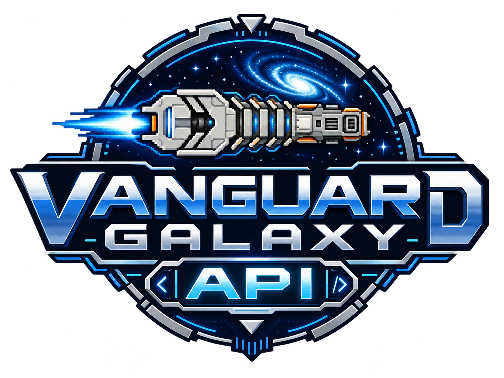
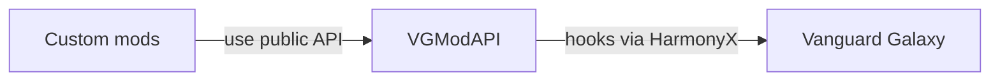

# VGModAPI

<p align="center">
  
</p>

Unofficial community mod API for Vanguard Galaxy, using BepInEx 5 and HarmonyX.

**0.1.30 development / experimental: automatically tested and partially exercised in-game, not fully runtime-qualified.** The API provides lifecycle, mod save data, optional mission/travel/story services and mod information, not a complete modding SDK. Controlled native evidence covers bounded paths; full in-game acceptance remains pending. See [compatibility](docs/compatibility.md) for coverage and limitations.

## Implemented

- Default-enabled experimental mod save data for additional custom payloads.
- Optional read-only [Forge/refining recipe catalog](docs/recipes.md): stable identities, variants and multi-producer lookup; no crafting mutations or native qualification implied.
- Optional experimental mission transitions and native travel/station observations.
- Optional experimental owned story definitions, native catalog installation, occurrence reconstruction and API-managed persistence for a closed mission subset.
- Mods menu with installed versions, descriptions and automatic update checks; no automatic downloads or installations.
- Runtime session identity, replacement/menu invalidation, player readiness, and gameplay-manager initialization.
- Coroutine-aware file-load observation and detected failure reporting.
- Save success/failure/skip outcomes, with recursive retries grouped into one operation.
- Main-thread-only disposable subscriptions, isolated subscriber exceptions, immutable event snapshots.
- Explicit capability availability and conservative installed-assembly compatibility gating.

`GameplayInitialized` does **not** mean every POI or UI is ready. Save success does not guarantee atomic sidecar persistence. Read the [lifecycle contract](docs/lifecycle-contract.md) before consuming events.

## Architecture and coupling

VGModAPI is an integration layer, **not another mod loader**. In the current design, both VGModAPI and consumer mods are BepInEx plugins. Players install BepInEx once; each mod does not bundle its own loader.



**BepInEx loads both VGModAPI and the custom mods.** Everything runs inside the game process; these boxes are not separate services or sandboxes. Internal assemblies are omitted to keep the main relationship clear.

| Dependency | Does a consumer mod need it? |
|---|---|
| BepInEx | **Yes for its plugin entry point.** Provides loading, dependency ordering, configuration, and logging. |
| Unity | The current `BaseUnityPlugin` entry point needs Unity compile references. Additional Unity APIs are needed only where the mod uses them, such as UI. |
| `VGModAPI.Abstractions` | **Yes for API use.** Compile against it; the API installation supplies the runtime assembly. |
| HarmonyX | **No direct reference for API-covered features.** Needed only if the consumer also creates its own patches. The API still uses HarmonyX at runtime. |
| `Assembly-CSharp` / private game members | **No for API-covered features.** Direct game integration outside API coverage reintroduces this coupling. |
| `VGModAPI.Core` / API implementation | **No direct consumer reference.** These are implementation details, not supported extension surfaces. |

A consumer can keep its BepInEx/Unity entry point small and put its actual logic in a separate plain .NET library that references only the public API contracts. That logic need not know about Harmony or vanilla classes. The included example remains a single project for simplicity.

**The boundary is feature-specific:** the API supports lifecycle, save data and the documented optional services, not a complete gameplay SDK. Story authoring is limited to its supported mission subset; ship creation, general scripted objectives and arbitrary HUD/gameplay UI integration are not provided. Using the lifecycle API does not automatically decouple unsupported parts of a mod.

Plugin entry points depend on BepInEx. Loader-independent discovery and a replacement loader are not provided.

## Build and test

Requires .NET SDK 10 for the tests; the shipped libraries target `netstandard2.1`.

```sh
make build                         # refresh local BepInEx/Unity reference symlinks; build all projects
make test                          # pure tests; no game installation needed
make check-bindings                # inspect original installed game DLL without executing it
make package CONFIGURATION=Release # explicit three-assembly package in artifacts/VGModAPI/
```

Public CI runs pure tests and synthetic Windows checks without game assets. See the [check strategy](docs/checks.md) for local reference provisioning, package validation, and provenance.

Override `GAME_DIR` and/or `DOTNET` as needed. Game/Unity/BepInEx DLLs are never committed or bundled. The runtime binds game internals through inspected reflection; it does not require a publicized game stub. The lifecycle API needs no serializer; custom save-data providers supply their own payload encoding.

## Experimental installation

Install BepInEx 5 once, then close the game and back up saves before changing plugins. Verify the experimental release ZIP against its adjacent SHA-256 file (`sha256sum -c *.zip.sha256`, or PowerShell `Get-FileHash`). Extract its `VGModAPI/` folder into `<game>/BepInEx/plugins/`. For source builds, use `make release-archive CONFIGURATION=Release`; this validates assembly identities/dependencies and creates a deterministic ZIP and checksum under `artifacts/`.

No automatic deploy target is provided. Remove older API copies from other plugin folders before installation; consumers must not bundle another `VGModAPI.Abstractions.dll`. Do not replace BepInEx/Unity/game DLLs. Start with disposable saves and inspect `BepInEx/LogOutput.log` for the assembly identity and capability failures. If unavailable, disable dependent features rather than overriding the hash gate. To uninstall, close the game and remove the API folder and any hard-dependent consumer plugins; leave saves and sidecars intact.

The package contains `VGModAPI.dll`, `VGModAPI.Core.dll`, and `VGModAPI.Abstractions.dll`, plus documentation. Keep one installed copy of these assemblies. An unsupported game hash leaves the service available for diagnostics but its lifecycle/save capabilities unavailable.

Optional boarding observation (API 0.1.25) is available through `ModApi.Boarding` when `[Boarding] Enabled = true` and `boarding-observation` is available. It provides copied targets/operations and scoped events, not commands or encounter authoring. API 0.1.26 additionally exposes `ModApi.BoardingRules` for disposable, scoped disable/chance, defender tuning, integrity, scuttle and explosion policies when `boarding-rules` is available. API 0.1.27 adds `ModApi.BoardingCommands` for validated, exclusively controlled operations when `boarding-commands` is available. API 0.1.28 adds tactical requests and scoped combat policies through `ModApi.BoardingTactics` and `ModApi.BoardingCombat`. API 0.1.30 adds opt-in `ModApi.Dungeons` for [authored dungeon content](docs/dungeon-content.md) with API-owned persistence. See [boarding](docs/boarding-contract.md); native qualification remains pending.

See [compatibility and qualification](docs/compatibility.md) for the inspected hash, completed checks, and pending in-game checklist. Development-only [controlled qualification tooling](docs/qualification-runner.md) uses an isolated game sandbox and copied saves; it is not included in the API package.

## Consume

Reference `VGModAPI.Abstractions.dll` as compile-only and declare:

```csharp
[BepInDependency(ModApi.PluginId, "0.1.0")]
```

In your BepInEx plugin's Awake, inspect `ModApi.Current.Capabilities`, query `CurrentSession` if needed, and subscribe:

```csharp
_subscription = ModApi.Current!.Subscribe("your.mod.id", message =>
{
    Logger.LogInfo($"{message.Kind}: session={message.Session?.Id}");
});
```

Dispose the subscription in OnDestroy. All access is main-thread-only. Callbacks should observe, not block or mutate in-progress game operations. Do not ship a separate copy of the abstractions DLL with each consumer.

A complete compiled example lives at `examples/LifecycleObserver/` in the source checkout. It is built by `make build` but is not included in the API package. Its `examples/LifecycleObserver/bin/Release/netstandard2.1/LifecycleObserver.dll` can be copied alone into a separate plugins folder for qualification event logging after `make build CONFIGURATION=Release`. Do not copy its dependency DLLs; use the single API installation.

## Optional save data

The API can manage each mod's save data alongside a particular game save. It publishes mod data only after the matching game save succeeds; the game and mod files are not written as one indivisible operation.

Enabled by default. Set `[Persistence] Enabled = false` in `BepInEx/config/vgmodapi.cfg` to opt out. For disposable-save testing, choose an absolute, short, non-linked `Root`. Never share the root across installations or delete it to work around a blocked load. The default save-data folder is under BepInEx config. An existing explicit `Enabled = false` remains an opt-out. Binding or path failures leave `ModApi.Persistence` null; check the `save-data` capability for availability.

## Owned bar rosters (experimental)

API 0.1.31 provides opt-in owner-scoped patrons, automatic persistent presentation, explicit additive/exclusive station policy, guarded interaction and finalized roster observation. A stored contribution is not a visibility guarantee. Narrative and voice data remain consumer-owned. See [bar rosters](docs/bar-rosters.md) for the contract and current qualification limits.

## Owned story content (experimental)

Require API 0.1.12, declare a hard BepInEx dependency, and acquire a provider lease from your own
`Start` with `ModApi.Story?.AcquireProvider(this)` (after Chainloader publishes the plugin instance). The lease registers immutable mission definitions
from a closed supported subset; the API installs them into the game's own story catalog, mints and
persists occurrence identity, and captures/restores that state itself, so you write no codec, no
save/load callback and no restoration scheduling for it. Definitions declare their source faction, because the game requires one to save a held mission.
Activating an occurrence asks the game to accept the mission and records it only if the game actually
did; completions are recorded from the game's own observed completion, never declared by you, with
choices you declared while the occurrence was live.
`ModApi.Story` is null unless the default-off story group is enabled and bound, with its persistence, protection and mission-transition prerequisites available. A separate, default-on load
safety guard stops API-owned missions in a save from advancing or paying out unless the owning module
vouches for them; with an uninspected game build, or with that guard turned off, this API cannot
refuse the load, so do not load saves containing owned story content in those states. See `docs/story-content.md`;
bounded native story paths are exercised, but full in-game acceptance remains pending.

## Register custom save data

Require API 0.1.2 and register a `PersistenceProvider` before any session starts. Supply your mod's unique identifier (the `Owner` namespace), data schema version, callbacks to capture, restore and validate your data, and optional explicit migrations. The API stores the bytes you provide without interpreting their contents, up to 1 MiB per mod. A null restore payload means genuinely absent known data, not corrupt data. No automatic import of existing sidecars is performed. Keep the returned `IPersistenceRegistration`, obey `MutationAllowed` before mutations, display `Status` on refusal, and dispose it before destroying provider state. For API 0.1.12 or newer, the handle also exposes optional `IPersistenceReadiness`: `StateReady` indicates whether restored state is readable, including during callback dispatch and an in-flight save when mutation is unsafe. Cast the handle to query it; an absent capability means readiness is unknown, not ready. Active-session removal pauses API-managed saves for all registered mods until a new load. Do not mutate vanilla state in these callbacks.

See [identity](docs/persistence-identity.md), [schema](docs/persistence-schema.md) and [storage/recovery](docs/persistence-storage.md) for identical-byte conflicts, durable intents and explicit filesystem-failure limits. This remains experimental. Actual MissionJournal0.3 and Stockpile0.7 API-managed save pilots exercise the documented paths; neither these controlled runs nor synthetic provider tests are a universal stability claim.

The pure `ContentSafety` admission/recovery planner requires API 0.1.3. See [persistent content ownership and removal](docs/content-safety.md) before accepting provider-specific item, mission, patron, faction or world references. It does not install content or promise safe uninstall.

## Source layout

- `VGModAPI.Abstractions`: consumer contract; no Unity or vanilla types.
- `VGModAPI.Core`: internal state machines and reflection adapter; no Unity/BepInEx dependency.
- `VGModAPI`: loader plugin and Harmony hooks.
- `VGModAPI.Tests`: pure tests, adapter doubles, and installed-metadata checks.

## Roadmap

The [pinned roadmap issue](https://github.com/fankserver/vanguard-galaxy-api/issues/1) links the [milestones](https://github.com/fankserver/vanguard-galaxy-api/milestones) and actionable issues, including acceptance criteria, evidence, priorities, and prerequisites. It is the source of truth for future work—not a promise of release dates.

Owned story content remains partial: supported schema compatibility is not general definition migration, and a scripted-objective API is not implemented. Bar composition, HUD/navigation, item/recipe/world content and update checking are not provided by the current services. Direct Harmony remains a version-sensitive escape hatch; bespoke gameplay stays in feature mods.

## Mod information

`ModApi.Mods` exposes process-local mod metadata. The default-enabled main-menu entry requires inspected native binding and can be disabled with `[ModInformation] MenuEnabled = false`. The catalog remains available independently of the menu. See [mod information](docs/mod-information.md) for registration and metadata rules. Full presentation acceptance, physical gamepad behavior and browser opening remain unqualified.

## License and experimental compatibility

Owned source and documentation are [MIT licensed](LICENSE). This does not license the game or its reference assemblies. Release packages contain only the three owned assemblies and owned documentation/license, not a loader, proprietary assets, qualification tools, or copied saves.

`Available` means the inspected adapter bindings were installed; implemented does not mean runtime-qualified. `RuntimeQualified` remains false. Only the exact hash in the compatibility document is accepted; other hashes are unsupported. The 0.1.x contract is experimental. Optional dispatch-state support requires API 0.1.1 and an explicit capability check; it is not part of `ILifecycleApi`. Consumers must require the API version needed by their services and handle unavailable optional capabilities. Incompatible contracts require explicit migration rather than silent replacement.

[Development contract](docs/implementation-plan.md) · [Native integration constraints](docs/research-findings.md)
