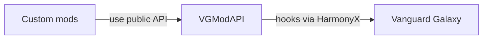

# VGModAPI

Unofficial community mod API for Vanguard Galaxy, using BepInEx 5 and HarmonyX.

**0.1.0 experimental: implemented and automatically tested, not yet qualified in-game.** This is a core lifecycle foundation, not a complete modding SDK. No existing mods have been migrated.

## Implemented

- Runtime session identity, replacement/menu invalidation, player readiness, and gameplay-manager initialization.
- Coroutine-aware file-load observation and detected failure reporting.
- Save success/failure/skip outcomes, with recursive retries grouped into one operation.
- Main-thread-only disposable subscriptions, isolated subscriber exceptions, immutable event snapshots.
- Explicit capability availability and conservative installed-assembly compatibility gating.

`GameplayInitialized` does **not** mean every POI or UI is ready. Save success does not guarantee atomic sidecar persistence. Read the [lifecycle contract](docs/lifecycle-contract.md) before consuming events.

## Architecture and coupling

VGModAPI is an integration layer, **not another mod loader**. In the current design, both VGModAPI and consumer mods are BepInEx plugins. Players install BepInEx once; each mod does not bundle its own loader.



**BepInEx loads both VGModAPI and the custom mods.** Everything runs inside the game process; these boxes are not separate services or sandboxes. Internal assemblies are omitted to keep the main relationship clear.

| Dependency | Does a consumer mod need it? |
|---|---|
| BepInEx | **Yes for its plugin entry point.** Provides loading, dependency ordering, configuration, and logging. |
| Unity | The current `BaseUnityPlugin` entry point needs Unity compile references. Additional Unity APIs are needed only where the mod uses them, such as UI. |
| `VGModAPI.Abstractions` | **Yes for API use.** Compile against it; the API installation supplies the runtime assembly. |
| HarmonyX | **No direct reference for API-covered features.** Needed only if the consumer also creates its own patches. The API still uses HarmonyX at runtime. |
| `Assembly-CSharp` / private game members | **No for API-covered features.** Direct game integration outside API coverage reintroduces this coupling. |
| `VGModAPI.Core` / API implementation | **No direct consumer reference.** These are implementation details, not supported extension surfaces. |

A consumer can keep its BepInEx/Unity entry point small and put its actual logic in a separate plain .NET library that references only the public API contracts. That logic need not know about Harmony or vanilla classes. The included example remains a single project for simplicity.

**The boundary is feature-specific:** version 0.1.0 exposes lifecycle observation, not a complete gameplay API. A mod that creates missions, ships, or UI will still need other integration until those optional services exist. Using VGModAPI for lifecycle does not automatically decouple the rest of that mod.

A future official integration could replace the internal game adapter while preserving suitable public contracts, but migrating away from BepInEx would still require changing plugin entry points. We do not currently provide loader-independent discovery or a replacement loader.

## Build and test

Requires .NET SDK 10 for the tests; the shipped libraries target `netstandard2.1`.

```sh
make build                         # refresh local BepInEx/Unity reference symlinks; build all projects
make test                          # pure tests; no game installation needed
make check-bindings                # inspect original installed game DLL without executing it
make package CONFIGURATION=Release # explicit three-assembly package in artifacts/VGModAPI/
```

Override `GAME_DIR` and/or `DOTNET` as needed. Game/Unity/BepInEx DLLs are never committed or bundled. The runtime binds game internals through inspected reflection; it does not require a publicized game stub. No serializer is needed by this milestone.

## Experimental installation

No automatic deploy target is provided. After approval for disposable-save testing, copy the generated `artifacts/VGModAPI/` folder into `<game>/BepInEx/plugins/`.

The package contains `VGModAPI.dll`, `VGModAPI.Core.dll`, and `VGModAPI.Abstractions.dll`, plus documentation. Keep one installed copy of these assemblies. An unsupported game hash leaves the service available for diagnostics but its lifecycle/save capabilities unavailable.

See [compatibility and qualification](docs/compatibility.md) for the inspected hash, completed checks, and pending in-game checklist.

## Consume

Reference `VGModAPI.Abstractions.dll` as compile-only and declare:

```csharp
[BepInDependency(ModApi.PluginId, "0.1.0")]
```

In your BepInEx plugin's Awake, inspect `ModApi.Current.Capabilities`, query `CurrentSession` if needed, and subscribe:

```csharp
_subscription = ModApi.Current!.Subscribe("your.mod.id", message =>
{
    Logger.LogInfo($"{message.Kind}: session={message.Session?.Id}");
});
```

Dispose the subscription in OnDestroy. All access is main-thread-only. Callbacks should observe, not block or mutate in-progress game operations. Do not ship a separate copy of the abstractions DLL with each consumer.

A complete compiled example lives at `examples/LifecycleObserver/` in the source checkout. It is built by `make build` but is not included in the API package. Its DLL can be installed separately for qualification event logging.

## Source layout

- `VGModAPI.Abstractions`: consumer contract; no Unity or vanilla types.
- `VGModAPI.Core`: internal state machines and reflection adapter; no Unity/BepInEx dependency.
- `VGModAPI`: loader plugin and Harmony hooks.
- `VGModAPI.Tests`: pure tests, adapter doubles, and installed-metadata checks.

[Implementation plan](docs/implementation-plan.md) · [Research findings](docs/research-findings.md)

Future optional modules cover persistence coordination, mission/story integration, bar policies, and HUD registration. Direct Harmony remains an escape hatch; bespoke gameplay stays in feature mods.
