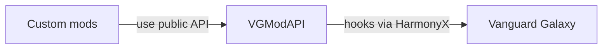

# VGModAPI

Unofficial community mod API for Vanguard Galaxy, using BepInEx 5 and HarmonyX.

**0.1.5 development / experimental: automatically tested and partially exercised in-game, not fully runtime-qualified.** This is a core lifecycle foundation, not a complete modding SDK. MissionJournal and Stockpile use the lifecycle API; controlled qualification is recorded, with complete owner acceptance still separate.

## Implemented

- Runtime session identity, replacement/menu invalidation, player readiness, and gameplay-manager initialization.
- Coroutine-aware file-load observation and detected failure reporting.
- Save success/failure/skip outcomes, with recursive retries grouped into one operation.
- Main-thread-only disposable subscriptions, isolated subscriber exceptions, immutable event snapshots.
- Explicit capability availability and conservative installed-assembly compatibility gating.

`GameplayInitialized` does **not** mean every POI or UI is ready. Save success does not guarantee atomic sidecar persistence. Read the [lifecycle contract](docs/lifecycle-contract.md) before consuming events.

## Architecture and coupling

VGModAPI is an integration layer, **not another mod loader**. In the current design, both VGModAPI and consumer mods are BepInEx plugins. Players install BepInEx once; each mod does not bundle its own loader.



**BepInEx loads both VGModAPI and the custom mods.** Everything runs inside the game process; these boxes are not separate services or sandboxes. Internal assemblies are omitted to keep the main relationship clear.

| Dependency | Does a consumer mod need it? |
|---|---|
| BepInEx | **Yes for its plugin entry point.** Provides loading, dependency ordering, configuration, and logging. |
| Unity | The current `BaseUnityPlugin` entry point needs Unity compile references. Additional Unity APIs are needed only where the mod uses them, such as UI. |
| `VGModAPI.Abstractions` | **Yes for API use.** Compile against it; the API installation supplies the runtime assembly. |
| HarmonyX | **No direct reference for API-covered features.** Needed only if the consumer also creates its own patches. The API still uses HarmonyX at runtime. |
| `Assembly-CSharp` / private game members | **No for API-covered features.** Direct game integration outside API coverage reintroduces this coupling. |
| `VGModAPI.Core` / API implementation | **No direct consumer reference.** These are implementation details, not supported extension surfaces. |

A consumer can keep its BepInEx/Unity entry point small and put its actual logic in a separate plain .NET library that references only the public API contracts. That logic need not know about Harmony or vanilla classes. The included example remains a single project for simplicity.

**The boundary is feature-specific:** version 0.1.x exposes lifecycle observation, not a complete gameplay API. A mod that creates missions, ships, or UI will still need other integration until those optional services exist. Using VGModAPI for lifecycle does not automatically decouple the rest of that mod.

A future official integration could replace the internal game adapter while preserving suitable public contracts, but migrating away from BepInEx would still require changing plugin entry points. We do not currently provide loader-independent discovery or a replacement loader.

## Build and test

Requires .NET SDK 10 for the tests; the shipped libraries target `netstandard2.1`.

```sh
make build                         # refresh local BepInEx/Unity reference symlinks; build all projects
make test                          # pure tests; no game installation needed
make check-bindings                # inspect original installed game DLL without executing it
make package CONFIGURATION=Release # explicit three-assembly package in artifacts/VGModAPI/
```

Public CI runs pure tests and synthetic Windows checks without game assets. See the [check strategy](docs/checks.md) for local reference provisioning, package validation, and provenance.

Override `GAME_DIR` and/or `DOTNET` as needed. Game/Unity/BepInEx DLLs are never committed or bundled. The runtime binds game internals through inspected reflection; it does not require a publicized game stub. No serializer is needed by this milestone.

## Experimental installation

Install BepInEx 5 once, then close the game and back up saves before changing plugins. Verify the experimental release ZIP against its adjacent SHA-256 file (`sha256sum -c *.zip.sha256`, or PowerShell `Get-FileHash`). Extract its `VGModAPI/` folder into `<game>/BepInEx/plugins/`. For source builds, use `make release-archive CONFIGURATION=Release`; this validates assembly identities/dependencies and creates a deterministic ZIP and checksum under `artifacts/`.

No automatic deploy target is provided. Remove older API copies from other plugin folders before installation; consumers must not bundle another `VGModAPI.Abstractions.dll`. Do not replace BepInEx/Unity/game DLLs. Start with disposable saves and inspect `BepInEx/LogOutput.log` for the assembly identity and capability failures. If unavailable, disable dependent features rather than overriding the hash gate. To uninstall, close the game and remove the API folder and any hard-dependent consumer plugins; leave saves and sidecars intact.

The package contains `VGModAPI.dll`, `VGModAPI.Core.dll`, and `VGModAPI.Abstractions.dll`, plus documentation. Keep one installed copy of these assemblies. An unsupported game hash leaves the service available for diagnostics but its lifecycle/save capabilities unavailable.

See [compatibility and qualification](docs/compatibility.md) for the inspected hash, completed checks, and pending in-game checklist. Development-only [controlled qualification tooling](docs/qualification-runner.md) uses an isolated game sandbox and copied saves; it is not included in the API package.

## Consume

Reference `VGModAPI.Abstractions.dll` as compile-only and declare:

```csharp
[BepInDependency(ModApi.PluginId, "0.1.0")]
```

In your BepInEx plugin's Awake, inspect `ModApi.Current.Capabilities`, query `CurrentSession` if needed, and subscribe:

```csharp
_subscription = ModApi.Current!.Subscribe("your.mod.id", message =>
{
    Logger.LogInfo($"{message.Kind}: session={message.Session?.Id}");
});
```

Dispose the subscription in OnDestroy. All access is main-thread-only. Callbacks should observe, not block or mutate in-progress game operations. Do not ship a separate copy of the abstractions DLL with each consumer.

A complete compiled example lives at `examples/LifecycleObserver/` in the source checkout. It is built by `make build` but is not included in the API package. Its `examples/LifecycleObserver/bin/Release/netstandard2.1/LifecycleObserver.dll` can be copied alone into a separate plugins folder for qualification event logging after `make build CONFIGURATION=Release`. Do not copy its dependency DLLs; use the single API installation.

## Optional coordinated persistence (0.1.2)

Disabled by default. For disposable-save testing, set `[Persistence] Enabled = true` in `BepInEx/config/vgmodapi.cfg` and choose an absolute, short, non-linked `Root`. Never share the root across installations or delete it to work around a blocked load. The default root is an owned folder under BepInEx config. Binding or path failures leave `ModApi.Persistence` null; check the `coordinated-persistence` capability.

Require API 0.1.2 and register a `PersistenceProvider` before any session starts. Supply an owner namespace, schema version, capture/restore/validation callbacks and optional explicit migrations. Payloads are opaque owned bytes, at most 1 MiB. A null restore payload means genuinely absent known data, not corrupt data. No automatic import of existing sidecars is performed. Keep the returned `IPersistenceRegistration`, obey `MutationAllowed` before mutations, display `Status` on refusal, and dispose it before destroying provider state. Active-session removal pauses all coordinated persistence until a new load. Do not mutate vanilla state in these callbacks.

See [identity](docs/persistence-identity.md), [schema](docs/persistence-schema.md) and [storage/recovery](docs/persistence-storage.md) for identical-byte conflicts, durable intents and explicit filesystem-failure limits. This remains experimental. Actual MissionJournal0.3 and Stockpile0.7 coordinated pilots exercise the documented paths; neither these controlled runs nor synthetic provider tests are a universal stability claim.

API 0.1.3 also exposes the pure `ContentSafety` admission/recovery planner. See [persistent content ownership and removal](docs/content-safety.md) before accepting provider-specific item, mission, patron, faction or world references. It does not install content or promise safe uninstall.

## Source layout

- `VGModAPI.Abstractions`: consumer contract; no Unity or vanilla types.
- `VGModAPI.Core`: internal state machines and reflection adapter; no Unity/BepInEx dependency.
- `VGModAPI`: loader plugin and Harmony hooks.
- `VGModAPI.Tests`: pure tests, adapter doubles, and installed-metadata checks.

## Roadmap

The [pinned roadmap issue](https://github.com/fankserver/vanguard-galaxy-api/issues/1) links the [milestones](https://github.com/fankserver/vanguard-galaxy-api/milestones) and actionable issues, including acceptance criteria, evidence, priorities, and prerequisites. It is the source of truth for future work—not a promise of release dates.

[Controlled core qualification](https://github.com/fankserver/vanguard-galaxy-api/issues/2) is recorded; persistence and save safety now include the opt-in service and both authorized consumer pilots; missing-content policy remains the next milestone item. Optional persistence, mission/travel, story/bar, HUD/navigation, and content modules follow demonstrated consumer needs. Direct Harmony remains an escape hatch; bespoke gameplay stays in feature mods.

## License and experimental compatibility

Owned source and documentation are [MIT licensed](LICENSE). This does not license the game or its reference assemblies. Release packages contain only the three owned assemblies and owned documentation/license, not a loader, proprietary assets, qualification tools, or copied saves.

`Available` means the inspected adapter bindings were installed; implemented does not mean runtime-qualified. `RuntimeQualified` remains false. Only the exact hash in the compatibility document is accepted; other hashes are unsupported. The 0.1.x contract is experimental: 0.1.1 adds optional dispatch-state support without changing ILifecycleApi. Consumers requiring that capability must require 0.1.1 and check it explicitly; future incompatible contracts require explicit migration rather than silent replacement. Consult each release's limitations before upgrading.

[Initial implementation plan](docs/implementation-plan.md) · [Research findings](docs/research-findings.md)
